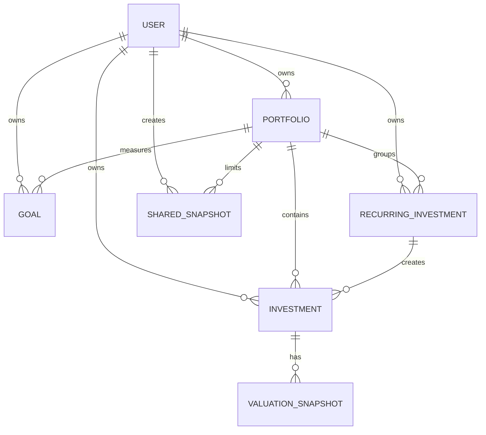

# Ledgr: Complete Project Guide

This document explains the Ledgr project from the beginning. It is intended for a developer, student, reviewer, or new team member who has not seen the code before.

It covers:

- what Ledgr does;
- the technologies used and why they are present;
- how the browser, React, Django, and PostgreSQL communicate;
- every database model and relationship;
- authentication and data security;
- backend and frontend file responsibilities;
- every API endpoint;
- calculations such as gains, dashboard totals, goals, recurring dates, stale data, and tax estimates;
- how a user operates every part of the app;
- how to install, run, test, and troubleshoot the project.

---

## 1. What Ledgr is

Ledgr is a full-stack investment tracker designed for manual data entry. A user records investments and manually updates their values. Version 1 does not contact stock exchanges, mutual fund services, cryptocurrency exchanges, or external price APIs.

A user can track:

- stocks;
- mutual funds;
- cryptocurrency;
- fixed deposits;
- real estate;
- gold;
- bonds;
- Public Provident Fund (PPF);
- Employees' Provident Fund (EPF);
- National Pension System (NPS);
- recurring deposits;
- Sovereign Gold Bonds (SGB);
- other investments.

The application can also:

- group investments into portfolios such as Personal, Family, or Retirement;
- calculate total value, invested amount, gain, and loss;
- record historical valuation entries;
- draw allocation and value-history charts;
- show the best and worst performing investments;
- import and export investments as CSV;
- track financial goals;
- plan and log recurring investments;
- display a simplified Indian tax estimate;
- warn about investments that have not been updated recently;
- create public, read-only links containing aggregate portfolio information.

All money values are stored in the database as decimal numbers. This avoids the rounding problems that can happen when financial data is stored as floating-point values.

---

## 2. Technology stack

### Backend

| Technology | Purpose |
|---|---|
| Python | Backend programming language |
| Django | Project configuration, database models, migrations, admin, user accounts |
| Django REST Framework (DRF) | JSON API, serializers, validation, permissions, viewsets |
| PostgreSQL | Permanent relational database |
| Simple JWT | Access-token and refresh-token authentication |
| django-cors-headers | Allows the React development server to call Django from another port |
| psycopg | PostgreSQL driver used by Django |
| python-dotenv | Loads private settings from `backend/.env` |

Backend dependency versions are declared in `backend/requirements.txt`.

### Frontend

| Technology | Purpose |
|---|---|
| React | Builds the user interface from reusable components |
| Vite | Development server and production bundler |
| React Router | Changes pages in the browser without a full reload |
| Axios | Sends HTTP requests to the Django API |
| Chart.js | Draws allocation and history charts |
| react-chartjs-2 | React wrapper for Chart.js |
| CSS | Responsive layout, colors, accessibility states, and animations |

Frontend dependency versions and scripts are declared in `frontend/package.json`.

---

## 3. The complete architecture

Ledgr has three main layers:

```text
User in browser
      │
      ▼
React frontend (localhost:5173)
      │  HTTP requests containing JSON and a JWT access token
      ▼
Django REST API (localhost:8000/api/)
      │  Django ORM queries
      ▼
PostgreSQL database
```

### Example: adding an investment

1. The user opens `/investments/new` in React.
2. `InvestmentFormPage.jsx` renders `InvestmentForm.jsx`.
3. The form validates the entered values in the browser.
4. The page calls `api.post('investments/', form)`.
5. The Axios request interceptor in `frontend/src/api.js` reads the access token from `localStorage`.
6. Axios adds `Authorization: Bearer <access-token>` to the request.
7. Django matches `/api/investments/` to `InvestmentViewSet` through the DRF router.
8. Simple JWT validates the token and places the logged-in user on `request.user`.
9. `InvestmentSerializer` validates the portfolio, type, amounts, quantity, and decimal precision.
10. `InvestmentViewSet.perform_create()` forces `user=request.user`. The browser cannot choose another owner.
11. Django's ORM converts the model creation into SQL and PostgreSQL stores the row.
12. DRF serializes the saved object into JSON.
13. React receives the JSON and opens `/investments/{id}`.
14. The detail page fetches the saved investment and displays it.

This same pattern—page, Axios, API route, authentication, serializer, view, model, database, JSON response—is used throughout the app.

---

## 4. Project directory structure

```text
WealthCanvas/
├── README.md                  Quick installation and run instructions
├── PROJECT_GUIDE.md           This complete explanation
├── backend/
│   ├── .env                   Local secrets and database credentials (not for Git)
│   ├── .env.example           Safe template showing required variables
│   ├── requirements.txt       Python dependencies
│   ├── manage.py              Django command-line entry point
│   ├── ledgr_backend/         Django project configuration
│   │   ├── settings.py        Installed apps, DB, JWT, CORS, timezone, pagination
│   │   ├── urls.py            Top-level API and admin routes
│   │   ├── wsgi.py            WSGI deployment entry point
│   │   └── asgi.py            ASGI deployment entry point
│   └── investments/           Main Django application
│       ├── models.py          Database structure and model calculations
│       ├── serializers.py     JSON conversion and API validation
│       ├── views.py           Endpoint logic and database queries
│       ├── permissions.py     Owner-only object permission
│       ├── signals.py         Creates a default portfolio for a new user
│       ├── apps.py            Loads the signal when Django starts
│       ├── admin.py           Django admin registrations
│       ├── tax.py             Simplified tax-estimate calculations
│       ├── tests.py           Backend automated tests
│       └── migrations/        Versioned database schema changes
└── frontend/
    ├── .env                   Local frontend configuration (not for Git)
    ├── .env.example           Safe frontend variable template
    ├── package.json           JavaScript dependencies and npm scripts
    ├── index.html             HTML document where React is mounted
    └── src/
        ├── main.jsx           React entry point, routes, header, protected pages
        ├── api.js             Axios client, tokens, refresh, shared API helpers
        ├── utils.js           Currency, percent, date, type labels and colors
        ├── utils.test.js      Frontend utility tests
        ├── styles.css         All shared responsive styling and motion
        ├── context/
        │   ├── AuthContext.jsx       Login state and auth actions
        │   ├── PortfolioContext.jsx  Portfolio list and active selection
        │   └── PreferencesContext.jsx Persisted Simple/Detailed view preference
        ├── components/        Reusable pieces used by pages
        └── pages/             One component for each browser page
```

Generated or local directories such as `backend/.venv`, `frontend/node_modules`, `frontend/dist`, and Python `__pycache__` folders are not application source code.

---

## 5. Environment configuration

Secrets and machine-specific values belong in `.env` files. Do not commit actual `.env` files or passwords.

### Backend variables

`backend/.env.example` contains:

| Variable | Meaning |
|---|---|
| `DJANGO_SECRET_KEY` | Cryptographic secret used by Django |
| `DJANGO_DEBUG` | Enables development error pages when `true` |
| `DJANGO_ALLOWED_HOSTS` | Host names Django accepts |
| `DATABASE_NAME` | PostgreSQL database name |
| `DATABASE_USER` | PostgreSQL role/user |
| `DATABASE_PASSWORD` | PostgreSQL password |
| `DATABASE_HOST` | PostgreSQL server, normally `localhost` locally |
| `DATABASE_PORT` | PostgreSQL port, normally `5432` |
| `CORS_ALLOWED_ORIGINS` | Frontend origins allowed to call the API |
| `FRONTEND_URL` | Base address used when generating public share URLs |

`settings.py` loads `backend/.env` with `python-dotenv` and passes the database settings to Django's PostgreSQL backend.

### Frontend variables

`frontend/.env.example` contains:

| Variable | Meaning |
|---|---|
| `VITE_API_URL` | API base URL, normally `http://localhost:8000/api/` |
| `VITE_CURRENCY` | Currency code used by formatting helpers, normally `INR` |

Vite exposes frontend variables only when their names begin with `VITE_`. Frontend variables are visible to browser users, so they must never contain passwords or private keys.

---

## 6. Django project configuration

The central backend configuration is `backend/ledgr_backend/settings.py`.

### Installed applications

- Django's admin, authentication, sessions, messages, content types, and static files;
- `rest_framework` for API features;
- `corsheaders` for cross-origin requests;
- `investments`, the project's main application.

### Middleware

Middleware runs around every request. Important entries include:

- security middleware;
- CORS middleware;
- session middleware for Django features such as admin;
- authentication middleware;
- CSRF protection;
- clickjacking protection.

### REST Framework defaults

The API uses JWT authentication by default and requires authentication by default. Individual public endpoints explicitly replace that permission.

Investment list responses use page-number pagination with 20 records per page. Several smaller resources such as portfolios and goals explicitly disable pagination.

### JWT lifetimes

- Access token: 30 minutes.
- Refresh token: 7 days.

The short-lived access token is sent on API requests. The refresh token is used to obtain a replacement access token without making the user log in again.

### Time handling

Django stores timezone-aware timestamps with `USE_TZ=True`. The configured Django timezone is UTC. Date-only values such as purchase dates are stored as dates without a time component.

---

## 7. Database design

Django models define the database schema. Migrations convert model changes into versioned SQL operations.

### Main relationships



`USER` is Django's built-in user model (`auth_user` table). The remaining tables are defined by the `investments` app.

### 7.1 Portfolio

A portfolio groups investments belonging to one user.

| Field | Meaning |
|---|---|
| `user` | Owner |
| `name` | User-visible group name |
| `created_at` | Creation timestamp |
| `is_default` | Whether new investments use this portfolio by default |

Database constraints prevent:

- more than one default portfolio for one user;
- duplicate portfolio names for the same user.

The same name can still be used by different users.

`default_portfolio_for(user)` returns the user's default portfolio. If none is marked default, it repairs the situation by choosing the first portfolio. If the user has no portfolio, it creates `Personal`.

### 7.2 Investment

An investment is one holding or one logged recurring installment.

| Field | Meaning |
|---|---|
| `user` | Owner |
| `portfolio` | Group containing the investment |
| `recurring_investment` | Optional recurring plan that created this entry |
| `type` | Asset type choice |
| `name` | User's name for the asset |
| `purchase_date` | Date acquired |
| `purchase_price` | Total amount invested, not unit price |
| `quantity` | Units held; defaults to 1 |
| `current_value` | Current total value entered by the user |
| `notes` | Optional free text |
| `created_at` | Creation timestamp |
| `updated_at` | Automatically updated whenever the model is saved |

Money uses `DecimalField(max_digits=15, decimal_places=2)`. Quantity supports six decimal places.

Calculated properties:

```text
gain_loss = current_value - purchase_price

gain_loss_pct = (gain_loss / purchase_price) × 100
```

The percentage returns zero if the purchase price is zero. Normal API validation prevents new zero-price investments, but the guard safely handles legacy or directly-created data.

`last_valuation_date` uses the latest valuation snapshot. If there are no snapshots, it uses the investment's `updated_at` date.

```text
days_since_last_update = today - last_valuation_date
```

### 7.3 ValuationSnapshot

A valuation snapshot records an investment's value on one date.

| Field | Meaning |
|---|---|
| `investment` | Parent investment |
| `date` | Valuation date |
| `value` | Total value on that date |

Deleting an investment deletes its snapshots because the foreign key uses `CASCADE`.

### 7.4 Goal

| Field | Meaning |
|---|---|
| `user` | Owner |
| `name` | Goal name |
| `target_amount` | Amount the user wants to reach |
| `target_date` | Desired date |
| `portfolio` | Optional portfolio; null means all portfolios |
| `created_at` | Creation timestamp |

### 7.5 RecurringInvestment

This is a plan, not an automatically-created investment.

| Field | Meaning |
|---|---|
| `user` | Owner |
| `portfolio` | Optional destination portfolio |
| `type` | Investment type created when an installment is logged |
| `name` | Plan name |
| `amount_per_installment` | Planned amount |
| `frequency` | Monthly or quarterly |
| `start_date` | First due date |
| `end_date` | Optional last date |
| `is_active` | Whether future installments are shown |

Due dates are calculated in memory; future installment rows are not saved in advance. If a plan starts on a month-end date such as 31 January, `installment_date()` safely uses the last valid day of shorter months.

When the user logs an installment, the backend creates a normal `Investment` and connects it through `recurring_investment`.

### 7.6 SharedSnapshot

| Field | Meaning |
|---|---|
| `user` | Link owner |
| `portfolio` | Optional portfolio; null means all portfolios |
| `token` | Unique, unguessable URL token |
| `created_at` | Creation timestamp |
| `expires_at` | Optional expiry date |
| `is_active` | Revocation status |

Tokens are generated with Python's `secrets.token_urlsafe(32)`.

The word “snapshot” in this model means a share link. The link reads the current aggregate data when visited; it is not a frozen copy of values from the link's creation time.

### Delete behavior

- Deleting a user cascades to that user's data.
- Deleting a portfolio cascades to its investments and share links, but the API prevents deletion while investments exist.
- Deleting a portfolio sets related goals and recurring plans to null because they use `SET_NULL`.
- Deleting a recurring plan does not delete already-logged investments; their link becomes null.
- Deleting an investment deletes its valuation history.

---

## 8. Migrations

Migrations are Django's database version history.

| Migration | Main change |
|---|---|
| `0001_initial.py` | Created Investment and ValuationSnapshot |
| `0002_indian_investment_types.py` | Added Indian asset choices such as PPF, EPF, NPS, RD, and SGB |
| `0003_portfolios.py` | Added Portfolio, assigned existing investments to Personal portfolios, added constraints |
| `0004_goal.py` | Added Goal |
| `0005_recurringinvestment_investment_recurring_investment.py` | Added recurring plans and linked installments |
| `0006_sharedsnapshot.py` | Added public share links |

Never edit an already-applied migration casually. Change a model, generate a new migration, review it, and then apply it:

```bash
cd backend
source .venv/bin/activate
python manage.py makemigrations
python manage.py migrate
```

`makemigrations` creates instructions. `migrate` executes pending instructions against the configured database.

---

## 9. Signals and default portfolio creation

`investments/apps.py` imports `signals.py` when Django starts.

`signals.py` listens for Django's `post_save` event on the user model. When a user is created, it creates a `Personal` portfolio marked as default.

This means registration performs two related actions:

1. `RegisterSerializer` creates the Django user.
2. The post-save signal automatically creates the user's first portfolio.

The signal also runs when users are created through Django admin, tests, or the shell.

---

## 10. Serializers and validation

Serializers connect JSON to Python/model objects. They:

- define which fields the API accepts and returns;
- convert text into dates and decimals;
- produce validation errors;
- ensure related objects belong to the logged-in user;
- serialize model properties and nested snapshots.

### Registration

`RegisterSerializer` applies Django password validators and calls `create_user()`, which hashes the password. Plain passwords are never saved.

### Investment validation

- purchase price must be greater than zero;
- quantity must be greater than zero;
- current value must be zero or greater;
- money fields allow at most two decimal places;
- the selected portfolio must belong to the logged-in user;
- a missing portfolio is replaced with the user's default portfolio.

If the calculated gain is above 5,000%, the serializer writes a warning to backend logs but accepts the entry. The frontend separately asks the user for confirmation because an unusually large gain may be a typing mistake.

### Goal validation

- target amount must be greater than zero;
- portfolio must belong to the current user.

### Recurring validation

- amount must be greater than zero;
- end date cannot be earlier than start date;
- portfolio must belong to the current user.

### Shared-link validation

- portfolio must belong to the current user;
- expiry cannot be in the past;
- token, URL, creation date, and active state cannot be chosen by the client.

---

## 11. Views and API logic

Viewsets provide standard list, create, retrieve, update, partial-update, and delete actions. The DRF router creates their URLs automatically.

### Owner scoping

Almost every queryset begins with a filter such as:

```python
Investment.objects.filter(user=request.user)
```

As a result, another user's ID behaves as if it does not exist and normally returns 404.

`IsInvestmentOwner` performs an additional object-level ownership check for investments.

`selected_portfolio(request)` validates the optional `?portfolio={id}` query parameter against the current user's portfolios. A user cannot use another user's portfolio ID to expose data.

### Transactions

`transaction.atomic()` groups related database operations. Either every operation succeeds, or PostgreSQL rolls all of them back. It is used when changing defaults, updating snapshot/current-value pairs, and logging recurring installments.

### Row locking

Portfolio default changes lock the user row with `select_for_update()`. This prevents two simultaneous requests from creating an inconsistent default-portfolio state.

---

## 12. API endpoint reference

All URLs below begin with `http://localhost:8000` during local development.

Unless explicitly marked public, send:

```http
Authorization: Bearer <access-token>
```

### Authentication

| Method and URL | Purpose |
|---|---|
| `POST /api/auth/register/` | Create account with username, email, password |
| `POST /api/auth/login/` | Receive access and refresh tokens |
| `POST /api/auth/refresh/` | Exchange refresh token for a new access token |

### Portfolios

| Method and URL | Purpose |
|---|---|
| `GET /api/portfolios/` | List the current user's portfolios |
| `POST /api/portfolios/` | Create one |
| `GET /api/portfolios/{id}/` | Retrieve one |
| `PUT/PATCH /api/portfolios/{id}/` | Rename it or make it default |
| `DELETE /api/portfolios/{id}/` | Delete an empty portfolio |

The API will not delete:

- a portfolio containing investments;
- the user's only portfolio.

If the default portfolio is deleted after another portfolio exists, the replacement becomes default.

### Investments

| Method and URL | Purpose |
|---|---|
| `GET /api/investments/` | Paginated investment list |
| `POST /api/investments/` | Create investment |
| `GET /api/investments/{id}/` | Investment details including snapshots |
| `PUT/PATCH /api/investments/{id}/` | Update investment |
| `DELETE /api/investments/{id}/` | Delete investment and history |
| `GET /api/investments/stale/?threshold_days=90` | Investments older than the threshold |
| `GET /api/investments/export/` | Download CSV |
| `POST /api/investments/import/` | Upload multipart CSV in field `file` |
| `GET /api/investments/{id}/tax-estimate/` | Simplified sale-today tax estimate |

Add `?portfolio={id}` to list, stale, or export requests to restrict results.

### Valuation history

| Method and URL | Purpose |
|---|---|
| `POST /api/investments/{id}/snapshot/` | Create valuation and update current value |
| `PUT/PATCH /api/investments/{investment_id}/snapshots/{snapshot_id}/` | Edit one valuation |
| `DELETE /api/investments/{investment_id}/snapshots/{snapshot_id}/` | Delete one valuation |

When the newest snapshot changes or is deleted, the investment's `current_value` is recalculated from the newest remaining snapshot. If no snapshots remain, it resets to `purchase_price`.

### Dashboard

| Method and URL | Purpose |
|---|---|
| `GET /api/dashboard/summary/` | Totals, gains, type allocation, stale count |
| `GET /api/dashboard/history/` | Portfolio value by snapshot date |
| `GET /api/dashboard/performers/` | Top three and bottom three by gain percentage |
| `GET /api/dashboard/tax-estimate/` | Combined computable tax estimates |

All dashboard endpoints accept optional `?portfolio={id}`.

### Goals

| Method and URL | Purpose |
|---|---|
| `GET/POST /api/goals/` | List or create goals |
| `GET/PUT/PATCH/DELETE /api/goals/{id}/` | Manage one goal |
| `GET /api/goals/{id}/progress/` | Current amount, progress and projection |

### Recurring investments

| Method and URL | Purpose |
|---|---|
| `GET/POST /api/recurring-investments/` | List or create plans |
| `GET/PUT/PATCH/DELETE /api/recurring-investments/{id}/` | Manage one plan |
| `GET /api/recurring-investments/upcoming/?days=30` | Compute upcoming due dates |
| `POST /api/recurring-investments/{id}/log-installment/` | Create a linked Investment |

### Shared links

| Method and URL | Purpose |
|---|---|
| `GET /api/shared-snapshots/` | List active links owned by user |
| `POST /api/shared-snapshots/` | Create a link |
| `DELETE /api/shared-snapshots/{id}/` | Revoke by setting `is_active=False` |
| `GET /api/public/snapshot/{token}/` | Public aggregate data; no JWT needed |

Invalid, expired, and revoked public tokens all return 404. The response contains summary and history only. It never returns investment names or notes.

---

## 13. Dashboard calculations

### Summary

For the current user and optional portfolio:

```text
total_invested = sum of purchase_price
total_net_worth = sum of current_value
total_gain_loss = total_net_worth - total_invested
total_gain_loss_pct = (total_gain_loss / total_invested) × 100
```

If total invested is zero, percentage is zero.

The type breakdown groups investments by `type`, totals current values, counts rows, and calculates each group's share of total value.

### History

`history_for()` reads every valuation snapshot chronologically. It remembers the latest known value for each investment and adds those latest values together on each snapshot date.

Only investments with valuation snapshots contribute to history. Current values without a snapshot do not create history points automatically.

### Performers

Investments with a positive purchase price are sorted by `gain_loss_pct`.

- `best`: up to three highest percentages;
- `worst`: up to three lowest percentages.

The same investment can appear in both lists when very few investments exist.

### Stale count

An investment is counted as stale when `days_since_last_update > 90`. Exactly 90 days is not considered stale.

---

## 14. Goal projection

Goal progress uses current portfolio value:

```text
progress_pct = current_amount / target_amount × 100
remaining_amount = max(target_amount - current_amount, 0)
```

For a projection, the backend takes history points from the most recent 90 days. It needs at least two points on different dates and positive growth.

```text
daily_growth = (last_value - first_value) / elapsed_days
days_to_goal = ceil(remaining_amount / daily_growth)
projected_date = today + days_to_goal
```

`on_track` is true when the projected date is on or before the target date.

If history is insufficient or growth is not positive, projection and on-track status are null rather than guessing.

---

## 15. Recurring investment behavior

A recurring plan represents an intention to invest. It does not change net worth until the user logs an installment.

The upcoming endpoint:

1. finds active plans;
2. computes their next due date from start date and frequency;
3. continues computing dates within the requested window;
4. returns the temporary list without saving it.

Logging an installment creates an Investment with:

- the plan's name and type;
- the submitted amount as both purchase price and current value;
- quantity 1;
- the submitted date;
- the recurring plan's portfolio, or the user's default portfolio;
- a link back to the recurring plan.

The recurring page's installment count and invested total come from these linked Investment rows.

---

## 16. CSV import and export

CSV columns are:

```text
name,type,purchase_date,purchase_price,quantity,current_value,notes,portfolio_name
```

### Export

The backend writes the current user's investments to a UTF-8 CSV response and sets `Content-Disposition` so the browser downloads it. The active portfolio filter is respected.

### Import

The frontend sends a multipart file upload. The backend:

1. checks that a file exists;
2. decodes UTF-8, accepting a UTF-8 BOM;
3. verifies required headers;
4. processes every row separately;
5. validates investment data with `InvestmentSerializer`;
6. uses a case-insensitive portfolio-name match;
7. creates a missing named portfolio automatically;
8. saves valid rows;
9. records errors for invalid rows without aborting the entire file.

The response looks like:

```json
{
  "created": 12,
  "errors": [
    {"row": 4, "message": "..."}
  ]
}
```

Each row is wrapped in its own database transaction, so a failed row does not leave partial data.

---

## 17. Tax estimate

Tax logic is isolated in `backend/investments/tax.py`.

The estimate uses recorded purchase price, current value, type, purchase date, and today's date. Negative gains are treated as zero for this estimate.

The current simplified branches in the code are:

- crypto: 30% of positive gain;
- stock and mutual fund: 20% short-term, or 12.5% of long-term gain above ₹1,25,000;
- long-term gold and real estate: 12.5% without indexation adjustment;
- short-term gold/real estate and asset types needing slab or subtype details: amount unavailable with an explanatory note.

The dashboard sums only estimates with numeric amounts and reports how many investments were skipped.

This feature is informational only. It does not know the user's tax slab, total annual gains, STT status, cess, surcharge, exemptions, acquisition expenses, exact mutual-fund classification, exact bond subtype, or every rule that may apply. The UI displays a tax-advice disclaimer.

---

## 18. Authentication from browser to API

### Register

`AuthPage.jsx` calls `AuthContext.register()`:

1. POST registration data;
2. after successful registration, immediately call login;
3. save returned tokens;
4. navigate to the dashboard.

### Login

Simple JWT verifies username/password and returns:

```json
{
  "access": "...",
  "refresh": "..."
}
```

The frontend stores these as `ledgr_access` and `ledgr_refresh` in `localStorage`.

### Authenticated request

The Axios request interceptor adds the access token to every non-auth request.

### Automatic refresh

If an API response is 401:

1. the response interceptor checks for a refresh token;
2. it calls `/api/auth/refresh/` once;
3. simultaneous failures reuse the same refresh promise;
4. it stores the new access token;
5. it repeats the original request.

If refresh fails, tokens are cleared and a `ledgr:logout` browser event updates React's auth state.

### Protected routes

`ProtectedRoute` reads `authenticated` from `AuthContext`. Unauthenticated users are redirected to `/login`. The public `/shared/:token` page is outside the protected route tree.

### Security note about localStorage

This implementation stores JWTs in browser local storage. It is simple for this project, but production applications must apply strong protection against cross-site scripting because JavaScript can read these tokens.

---

## 19. Frontend routing and layout

`frontend/src/main.jsx` mounts React and defines routes.

| Browser route | Component | Purpose |
|---|---|---|
| `/login` | `AuthPage` | Login |
| `/register` | `AuthPage` | Registration |
| `/dashboard` | `DashboardPage` | Overview and charts |
| `/investments` | `InvestmentsPage` | Searchable, sortable list and CSV tools |
| `/investments/new` | `InvestmentFormPage` | Create investment |
| `/investments/:id` | `InvestmentDetailPage` | Details, valuations, tax estimate |
| `/investments/:id/edit` | `InvestmentFormPage` | Edit investment |
| `/goals` | `GoalsPage` | Goal list and form |
| `/recurring` | `RecurringPage` | Recurring-plan management |
| `/portfolios` | `PortfoliosPage` | Portfolio management |
| `/shares` | `SharedPage` | Create and revoke links |
| `/shared/:token` | `SharedPublicPage` | Public aggregate view |

Unknown routes redirect to `/dashboard`.

`ShellContent` provides the shared header, portfolio selector, navigation, add button, and sign-out button.

---

## 20. React contexts

### AuthContext

Provides:

- `authenticated`;
- `login(username, password)`;
- `register(username, email, password)`;
- `logout()`.

Pages call `useAuth()` instead of duplicating token-state logic.

### PortfolioContext

Provides:

- all user portfolios;
- the active portfolio ID;
- the default portfolio;
- loading and error states;
- `refresh()` after portfolio-changing operations.

The active ID is stored in `localStorage` under `ledgr_selected_portfolio`, so it survives page refreshes. If the stored portfolio no longer exists, the context clears the selection.

Pages pass the active portfolio as an API query parameter. An empty selection means all portfolios.

---

## 21. Frontend shared files and components

### `api.js`

- creates the Axios instance;
- attaches JWT tokens;
- refreshes expired access tokens;
- converts API errors into readable messages;
- retrieves every page of investments;
- combines each goal with its progress endpoint.

### `utils.js`

- maps type codes to labels;
- defines chart colors;
- formats exact currency with Indian digit grouping;
- abbreviates large amounts into lakh/crore display;
- caps extreme percentages at a readable label;
- formats dates.

Examples:

```text
45230     → ₹45,230.00
3250000   → ₹32.5 L
325000000 → ₹32.5 Cr
```

### Main reusable components

| Component | Responsibility |
|---|---|
| `SummaryCards` | Total money, invested amount, value change |
| `Charts` | Doughnut allocation and line history charts |
| `InvestmentTable` | Search, type filter, sorting, stale indicators, row actions |
| `InvestmentForm` | Add/edit fields, client validation, high-gain confirmation |
| `InvestmentTypeIcon` | Shared SVG icons for asset types |
| `PerformersWidget` | Best/worst links |
| `GoalsWidget` | Dashboard goal summary |
| `ConfirmDialog` | Keyboard-friendly destructive-action confirmation |

### Styling

`styles.css` contains global styles, responsive breakpoints, focus indicators, colors, and soft motion.

Animations are placed inside `prefers-reduced-motion: no-preference`. When the operating system requests reduced motion, the CSS disables animation and transitions.

---

## 22. Investment form behavior

The form validates before calling the API:

- portfolio is selected;
- name is present;
- date is a real calendar date;
- date is not in the future;
- invested amount is positive and has no more than two decimal places;
- quantity is positive;
- current value is non-negative and has no more than two decimal places.

Native date inputs behave differently across browsers. The code checks `validity.badInput`, validates year/month/day itself, and remounts the date input when an impossible typed date must be cleared.

If gain would exceed 5,000%, submission pauses and displays the exact invested amount, current value, and percentage. The user must choose Continue before the request is sent.

Backend validation still runs even after frontend validation. Browser checks improve usability; backend checks protect the database.

---

## 23. How each page loads data

### Dashboard

Loads in parallel:

- dashboard summary;
- dashboard history;
- performers;
- all paginated investments;
- goals plus progress;
- upcoming recurring installments;
- dashboard tax estimate.

It then renders the summary, reminders, widgets, charts, and investment table.

### Investment list

Loads all pagination pages through `getAllInvestments()`. Searching, type filtering, and sorting happen in the browser. CSV actions call the import/export endpoints.

### Investment detail

Loads investment details and the tax estimate. It supports:

- edit;
- confirmed investment deletion;
- create valuation;
- edit valuation;
- confirmed valuation deletion.

### Goals

Loads goals and makes a progress request for each goal. It creates and deletes goals from the same page.

### Recurring

Lists plans with calculated next date, installment count, and total. It creates, edits, deletes, and logs installments.

### Shared links

Lists active links, creates a link for one or all portfolios, copies URLs, and revokes links.

### Public page

Uses a plain Axios request without the authenticated API client. It shows only aggregate cards and charts.

---

## 24. User guide

### 24.1 Create an account

1. Open `http://localhost:5173/register`.
2. Enter username, email, and password.
3. Select **Create account**.
4. Ledgr logs in automatically.
5. A default `Personal` portfolio is already available.

### 24.2 Sign in and sign out

Use `/login` with username and password. Select **Sign out** in the header to clear browser tokens.

### 24.3 Add an investment

1. Select **Add investment** in the header.
2. Choose a portfolio and type.
3. Enter a name and purchase date.
4. Enter the total amount invested.
5. Enter quantity and today's total value.
6. Add optional notes.
7. Select **Add investment**.
8. Confirm unusual values if Ledgr detects a possible typo.

### 24.4 View and filter investments

Open **Investments**. Search by name, filter by type, and select a column heading to sort. Use the portfolio selector in the header to show one portfolio or all portfolios.

### 24.5 Edit or delete an investment

Use the row actions or open the detail page. Deletion always asks for confirmation and also removes valuation history.

### 24.6 Record a new value

1. Open the investment.
2. Select **Log new valuation**.
3. Enter date and total value.
4. Save.

The investment's current value changes to the new snapshot value. Existing entries can be edited or deleted from valuation history.

### 24.7 Manage portfolios

Open **Manage portfolios** to create, rename, select a default, or delete an empty portfolio. Move or delete investments before deleting a portfolio containing them.

### 24.8 Import CSV

1. Open **Investments**.
2. Download the template.
3. Fill the rows using valid type codes and `YYYY-MM-DD` dates.
4. Select **Import CSV** and choose the file.
5. Review the success count and individual row errors.

### 24.9 Export CSV

Use **Export CSV** on the Investments page. The current portfolio selection controls which rows are exported.

### 24.10 Create a goal

Open **Goals**, enter a name, target amount, date, and optional portfolio. Progress uses current investment values. A projected date appears only when valuation history is sufficient.

### 24.11 Create and log a recurring plan

1. Open **Recurring**.
2. Enter plan details, amount, frequency, dates, and portfolio.
3. Save the plan.
4. When a payment happens, select **Log this installment**.
5. Confirm its date and actual amount.

The logged installment then appears as a normal investment.

### 24.12 Review stale investments

The dashboard displays a reminder when an investment has not been updated for more than 90 days. Follow the reminder to the filtered list, open an investment, and log a valuation.

### 24.13 Share an aggregate portfolio view

1. Select **Share snapshot** on the dashboard or open **Shared links**.
2. Choose all portfolios or one portfolio.
3. Optionally choose an expiry date.
4. Create and copy the link.
5. The recipient can open it without signing in.
6. Revoke the link from **Shared links** when it should stop working.

The public page does not show investment names, notes, edit controls, or private navigation.

---

## 25. Django admin

Create an admin user:

```bash
cd backend
source .venv/bin/activate
python manage.py createsuperuser
```

Start Django and open `http://localhost:8000/admin/`.

Admin registrations exist for portfolios, investments, snapshots, goals, recurring plans, and shared links. The investment list flags gains above 5,000% as a possible typo.

Admin is intended for trusted administrators. It does not replace owner-scoped API permissions.

---

## 26. Installation and running locally

### Requirements

- Python 3.10 or newer;
- PostgreSQL;
- Node.js 20 or newer;
- npm.

### Backend terminal

```bash
cd /home/sahil/Downloads/Desktop/WealthCanvas/backend
python3 -m venv .venv
source .venv/bin/activate
pip install -r requirements.txt
cp .env.example .env
```

Edit `.env` with the database you intend to use. Then:

```bash
python manage.py migrate
python manage.py runserver 8000
```

### Frontend terminal

```bash
cd /home/sahil/Downloads/Desktop/WealthCanvas/frontend
cp .env.example .env
npm install
npm run dev
```

Open `http://localhost:5173/`.

Both servers must run at the same time:

- React serves the interface on port 5173.
- Django serves the API on port 8000.
- PostgreSQL runs separately, normally on port 5432.

---

## 27. Tests

### Backend

With the backend virtual environment active and PostgreSQL available:

```bash
cd backend
python manage.py test
```

Tests cover:

- gain/loss calculations;
- input validation and decimal precision;
- user ownership isolation;
- snapshot synchronization;
- portfolio defaults, deletion, and filtering;
- performer rankings;
- CSV mixed success/error behavior;
- goal projections;
- recurring date math and linked installments;
- tax-estimate rules and boundary dates;
- stale thresholds;
- public-link privacy, expiration, and revocation.

### Frontend

```bash
cd frontend
npm test
npm run build
```

`npm test` runs utility tests. `npm run build` also catches JSX/import/bundling failures and creates `frontend/dist`.

---

## 28. Common development tasks

### After changing a model

```bash
cd backend
source .venv/bin/activate
python manage.py makemigrations
python manage.py migrate
python manage.py test
```

### After changing the frontend

```bash
cd frontend
npm test
npm run build
```

### Open a Django shell

```bash
cd backend
source .venv/bin/activate
python manage.py shell
```

Use the shell carefully because it reads and writes the configured database.

### Check pending migrations

```bash
python manage.py showmigrations
python manage.py makemigrations --check --dry-run
```

---

## 29. Troubleshooting

### PostgreSQL “role already exists” or “database already exists”

Those messages mean creation was attempted for an existing object. Do not recreate or alter a database you want to preserve. Create a differently named role/database or point `.env` at the correct existing database.

### “Permission denied” while using `sudo -u postgres`

PostgreSQL's system user may not have permission to enter the current project directory. Run database-administration commands from a public directory such as `/tmp`, or use `psql` with appropriate credentials. This directory warning does not necessarily mean PostgreSQL itself is broken.

### Django cannot connect to PostgreSQL

Check:

- PostgreSQL service is running;
- database name exists;
- role exists;
- password matches;
- host and port are correct;
- `backend/.env` is being used;
- the role can access the database.

### Browser reports a CORS error

Ensure the exact frontend origin is in `CORS_ALLOWED_ORIGINS`, including scheme and port, then restart Django.

### API returns 401

The access token may have expired. The frontend should refresh it automatically. If the refresh token is missing or expired, sign in again.

### API returns 404 for an existing numeric ID

Owner-scoped querysets intentionally hide another user's objects as 404. Also confirm the active database and account.

### Migration errors

Run `python manage.py showmigrations`. Confirm the database points to the intended environment. Do not delete migration files or use `--fake` without understanding the existing schema.

### Frontend cannot call backend

Confirm:

- Django is running on port 8000;
- Vite is running on port 5173;
- `VITE_API_URL` ends with `/api/`;
- CORS allows the frontend origin.

Restart Vite after changing its `.env` because environment variables are read at startup.

---

## 30. Important limitations

- Values are manual; Ledgr does not fetch live prices.
- Dashboard history exists only when valuation snapshots have been logged.
- A public share link shows current aggregate data rather than a frozen historical copy.
- Goal projection is a simple linear estimate based on recent snapshots.
- Tax estimates are deliberately simplified and are not filing advice.
- The interface supports persisted Simple and Detailed modes. Language translation infrastructure is not currently implemented.
- JWT tokens are stored in local storage, which requires careful XSS protection in production.
- The Django development server and Vite development server are not production servers.

---

## 31. Recommended order for learning the code

For a new developer, read files in this order:

1. `README.md` — run commands.
2. `backend/investments/models.py` — understand stored data.
3. `backend/investments/serializers.py` — understand API fields and validation.
4. `backend/investments/views.py` — understand behavior and queries.
5. `backend/ledgr_backend/urls.py` — connect behavior to URLs.
6. `frontend/src/main.jsx` — understand browser routes and shared layout.
7. `frontend/src/api.js` — understand frontend/backend communication.
8. `frontend/src/context/` — understand shared login and portfolio state.
9. `frontend/src/pages/` — understand each screen.
10. `frontend/src/components/` — understand reused UI.
11. `backend/investments/tests.py` — see expected behavior in executable examples.

---

## 32. Short mental model

If you remember only one flow, remember this:

```text
React page
  → shared component collects input
  → Axios sends JSON with JWT
  → Django URL chooses a view
  → JWT identifies request.user
  → serializer validates input
  → view restricts data to request.user
  → model/ORM reads or writes PostgreSQL
  → serializer produces JSON
  → React stores response in state
  → components render the updated screen
```

That is the central working pattern of Ledgr. Every feature is a variation of this flow.


## Simple and Detailed view preference

Each account has one `UserPreference` row linked to Django's `User` model. New accounts receive a preference automatically through the user creation signal. Its `view_mode` is `simple` by default and accepts either `simple` or `detailed`.

The authenticated `GET /api/preferences/` endpoint returns the current setting. `PATCH /api/preferences/` updates it. `UserPreferenceView` uses `get_or_create`, so accounts created before this feature receive their preference when they first load the app.

On the frontend, `PreferencesProvider` loads this endpoint inside the protected application shell. The header's Simple/Detailed control updates the interface immediately, sends the PATCH request, and restores the prior value if saving fails. Because the setting lives in PostgreSQL, it follows the user between browsers and devices.

Simple mode keeps the portfolio summary, allocation chart, and a condensed investment table containing the investment name, type, current value, and gain percentage. Detailed mode renders the full existing dashboard widgets and the full investment table. Both modes use the same `DashboardPage` and `InvestmentTable` components; conditional rendering and a `simple` prop select the amount of detail.
